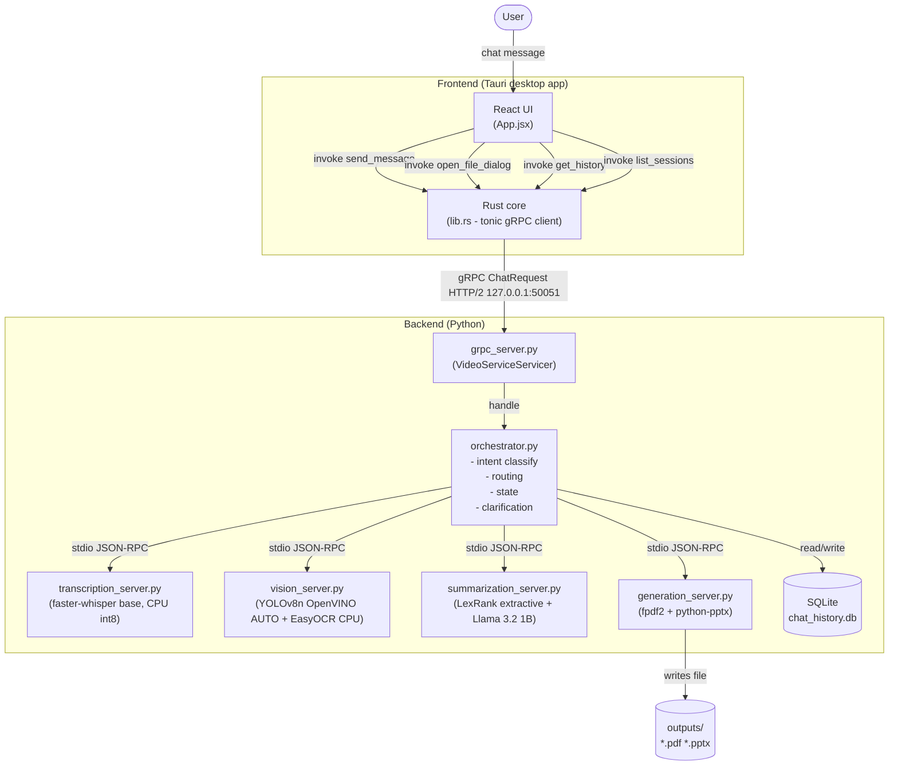

# Architecture

## Overview

A fully local, offline desktop app. The user picks an `.mp4` file and chats
with it in natural language: transcribe, detect objects/graphs, summarize,
generate PDF/PPTX reports. Nothing leaves the machine at runtime.

## Component diagram



## Data flow for a typical query

```
User types "summarize the video"
  -> React invoke("send_message", {sessionId, text, videoPath})
  -> Rust tonic client sends ChatRequest over gRPC to 127.0.0.1:50051
  -> Python VideoServiceServicer.SendMessage()
  -> orchestrator.handle(session_id, text, video_path)
     -> _classify(text) returns [("summarize", 1.0)]
     -> _pick_intent() returns "summarize"
     -> _handle_summarize():
        -> if transcript not cached: MCPClient.call("transcribe", video_path)
           -> spawns transcription_server.py subprocess (first use)
           -> writes JSON-RPC request to subprocess stdin
           -> reads JSON-RPC response from subprocess stdout
           -> caches result in _sessions[session_id]
        -> MCPClient.call("summarize", text=transcript, mode="brief")
           -> spawns summarization_server.py subprocess (first use)
           -> LexRank sentence ranking
           -> returns {key_points, summary}
     -> database.save_message() for user turn + assistant reply
     -> returns ChatResponse dict
  -> gRPC ChatResponse back to Rust
  -> Rust serializes to JSON (camelCase) via serde
  -> React renders assistant bubble with reply text
```

## Component responsibilities

| Component | Responsibility |
|---|---|
| `React (App.jsx)` | Chat UI, message rendering, clarification option buttons, artifact notices (clickable), session browser, file picker |
| `Rust (lib.rs)` | Tauri command handlers, tonic gRPC client, serde JSON bridge to webview |
| `grpc_server.py` | gRPC server entrypoint, binds to 127.0.0.1, delegates to orchestrator |
| `orchestrator.py` | Intent classification, routing, session state, clarification logic |
| `transcription_server.py` | Speech-to-text via faster-whisper (MCP server, stdio JSON-RPC) |
| `vision_server.py` | Object detection (YOLOv8n/OpenVINO) + OCR/graph detection (EasyOCR) |
| `summarization_server.py` | Extractive summarization via LexRank (sumy + NLTK) |
| `generation_server.py` | PDF (fpdf2) and PPTX (python-pptx) file generation |
| `database.py` | SQLite read/write for chat history and session persistence |
| `mcp_common/server.py` | Base MCP server: stdio JSON-RPC read-dispatch-reply loop |
| `mcp_common/client.py` | Base MCP client: subprocess lifecycle, JSON-RPC send/receive |

## Key design decisions

**Why gRPC between Rust and Python?**
The Tauri webview is a browser context - it cannot speak raw HTTP/2 gRPC. The
Rust layer has no such restriction. Moving the gRPC client to Rust keeps the
binary protocol out of the npm bundle and uses the process that already has full
OS permissions.

**Why MCP stdio JSON-RPC for Python-to-Python calls?**
Each capability server is an isolated subprocess. The orchestrator only knows
each server's JSON-RPC interface, not its internals. A server can be restarted,
swapped, or upgraded without touching the orchestrator. This is the MCP stdio
transport spec.

**Why extractive summarization?**
LexRank selects real sentences from the transcript - no model download, no GPU,
fully deterministic, always grammatically correct. The interface is clean enough
that a generative LLM could replace the implementation without changing any
caller.

**Why keyword-based intent classification?**
Transparent and defensible: every routing decision can be explained line by line.
The `_classify()` function returns `(intent, confidence)` - a trained classifier
(e.g. TF-IDF + logistic regression) could replace the body without changing anything
else. Discrete confidence levels (1.0 strong, 0.6 weak) avoid the need for training
data while still ranking clarification options sensibly.

**CPU-first everywhere**
- faster-whisper: `device="cpu"`, `compute_type="int8"`
- OpenVINO: `device_name="AUTO"` (CPU fallback, never `"GPU"` or `"cuda"`)
- EasyOCR: `gpu=False`
- No CUDA-pinned wheels in `requirements.txt`

## Folder structure

```
/backend
  /mcp_common         - MCPServer + MCPClient base classes
  /mcp_servers        - transcription, vision, summarization, generation servers
  /orchestrator       - intent classification, routing, state, clarification
  /proto              - video.proto + generated Python stubs
  /storage            - SQLite access layer
  grpc_server.py      - gRPC entrypoint
/frontend
  /src                - React app (App.jsx, App.css)
  /src-tauri          - Rust core (lib.rs, build.rs, Cargo.toml, proto/)
/models               - gitignored; populated by download_models.py
/outputs              - gitignored; generated PDFs and PPTX files
/samples              - sample mp4, sample_queries.md, sample outputs
/docs                 - ARCHITECTURE.md, SETUP.md, WRITEUP.md, BUILD_LOG.md
download_models.py
requirements.txt
```
